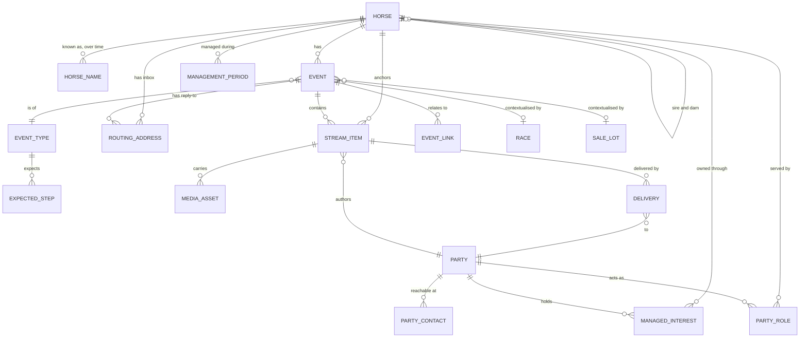
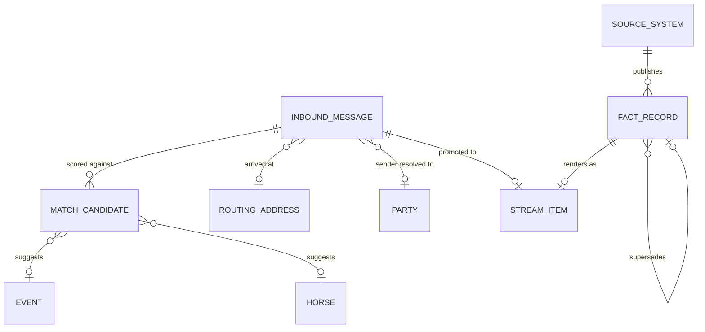
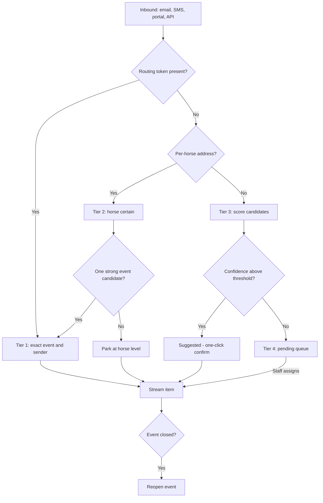

# Laurel Oak Bloodstock — Data Model Sketch

_Draft v0.3 — 2 Sep 2026. Conceptual model, not schema. Entity names are in CAPS for readability; the point is the shape and the relationships, not the eventual table names._

Companion to `claude/project-outline.md`. **Ownership and access are specified in `claude/ownership-model.md`**; settled questions and their reasoning are logged in `claude/decisions.md`.

---

## The one-paragraph version

**The horse is the aggregate root.** An **event** is a chapter in that horse's life. A **stream item** is a single line in the chapter — a message, a fact, a photo, a voice note. Everything the business does to or says about a horse ends up as a stream item, and the only question the system ever really has to answer is *which horse, which event, who can see it*.

---

## 1. Core diagram

---

## 2. Entities

### HORSE
The permanent record. One row from the moment a horse is a sale prospect until long after it leaves.

Holds: sex, colour, foaling date, country, sire and dam (self-references), external identifiers (Arion, racing body, microchip, brand), current life phase, management status.

**Management status** matters: most horses in the table are *reference only* — they exist because they are somebody's sire or dam. A smaller set are *managed* by Laurel Oak. One table for both, flagged, keeps pedigree links trivial.

**Life phase** — Prospect, In Training, Spelling, Retired, Broodmare, Stallion, Sold, Deceased — is a current-state convenience. The truth is in the event history; the phase is what the UI reads to decide what to show.

### HORSE_NAME
The alias history, and the reason mail from two seasons ago still matches.

Holds: name, kind (Sale Lot / Unnamed, Registered, Stable Name, Former Registered Name), valid from, valid to, source.

An unnamed yearling gets a working name (`Snitzel x Faultless '24`) plus its sale lot reference. When it is registered, the old name closes and the new one opens — nothing is overwritten. Every name in this table is a live matching key forever.

### PARTY
Any person or organisation: owner, trainer, vet, farrier, agent, stud, race club, racing body, syndicate. One table, typed.

Deliberately generic. The same person is an owner in one horse and a vendor in another, and a trainer who owns a leg of the horse he trains is completely ordinary.

### PARTY_CONTACT
A channel identity: email address, mobile number, portal login. Many per party, one flagged primary, each verified or not.

People email from three addresses and text from a number that appears in none of them. Per-recipient routing tokens (below) reduce how much this table has to carry, but it still matters.

### MANAGEMENT_PERIOD, MANAGED_INTEREST, HOLDING_ENTITY, REGISTERED_OWNERSHIP
Ownership is two separate ledgers — what the industry registers, and what Laurel Oak manages — and it carries the access rules for the whole system.

**See `claude/ownership-model.md`.** In summary: a horse has management periods; inside a period, parties hold managed interests; managed interests sit behind holding entities that correspond to lines in the official registered ownership record; and some registered lines map to nothing internal by design.

### PARTY_ROLE
Non-ownership working relationships, date-bounded: trainer, manager, vet, farrier, agistment, agent, vendor, purchaser.

Trainers change. When a horse moves stables mid-preparation, last month's trainer should not keep receiving this month's updates, and last month's messages should still show the right author.

### EVENT
A chapter. Opens when there is something to communicate about, and **closes only when a person closes it**.

Holds: horse, event type, title, status, key date, opened / closed timestamps, closed-by, and a typed context payload.

**Lifecycle (D11).** Status is Draft / Open / Closed / Cancelled. Nothing closes automatically — a race event can run well past the day-after report, and a celebration dinner a week after a win still belongs to that race. A closed event that receives a matching item **reopens itself** rather than rejecting it.

Because open/closed is a human judgement, the matcher cannot lean on it. Two derived values do the work instead:

- **Dormancy** — open, but no activity for *n* days. Surfaced in the UI as a nudge to close, and de-weighted in candidate scoring.
- **Expected window** — from the event type's step template relative to the key date. A race start expects traffic from nomination to a fortnight after the race; something arriving four months later is a weak candidate however open the event is.

### EVENT_TYPE and EXPECTED_STEP
The template. An event type declares the steps it expects, in order, with the source that normally supplies each one and roughly when it is due relative to the key date.

Powers "what stage is this at" and "the acceptance is in but nobody has sent the pre-race update". A stream item can carry the step code it satisfies, so progress is measured, not guessed.

### EVENT_LINK
Events relate across horses. The covering that produced a foal, the sale where we bought the mare, the race start that ended a campaign. A typed link table keeps these explicit without inventing a hierarchy.

### STREAM_ITEM
One line in the stream, and the single unifying object in the system.

Holds: horse (**always**), event (**nullable**), kind, author, occurred-at, recorded-at, direction (Inbound / Outbound / Internal), **scope**, step code, body or summary.

Three decisions inside this one entity carry a lot of weight:

- **Kind separates facts from messages.** A *fact* is data from a source system — a nomination, an acceptance, an official result — with a structured payload, a source reference, and the ability to be superseded when the feed corrects itself. Barriers change, scratchings happen, results get amended. A *message* is human correspondence: immutable once sent, with channel and threading detail. A *media* item is a photo, video or voice note. A *note* is internal.
- **A nullable event is a feature.** It is how something addressed to the horse but not clearly tied to an event gets parked on the horse's timeline instead of guessed into the wrong chapter. Staff move it onto an event later, or leave it where it is.
- **Scope carries all the confidentiality.** Internal / Owners / Owners at the time / Named parties / Trainer. Because access follows current ownership rather than dates, scope is the *only* thing preventing a new owner reading the previous owner's business.

### Scope and audience — the hard rule

**Trainers never see owner replies (D12).** This is not a filter applied at render time; it is a constraint on how messages are composed and sent:

> **An outbound message addresses exactly one audience class.** A trainer and an owner are never on the same thread, never cc'd together, and no reply-all can cross between them.

An update that needs to reach both goes out as two messages with two routing tokens, landing as two related items in the same event stream. Staff see both. Neither recipient sees the other's.

### DELIVERY
Per-recipient send record: party, channel, address used, status (Queued / Sent / Delivered / Bounced), timestamps, and viewed-at for portal reads.

This is the audit trail — who was told, when, and did they open it.

**Recipient lists are computed at send time**, never stored ahead. An owner who exited this morning must not receive tonight's queued update.

### ROUTING_ADDRESS
A token, its scope, the target it points at, the address or number it renders as, and whether it is still active.

**Tokens are issued per recipient, not per event (D12).** This does two jobs at once: it makes cross-audience leakage structurally impossible, and it means a reply from an address the system has never seen still identifies the sender exactly — a tier 1 match with no lookup required.

Per-horse inboxes are the same mechanism scoped to a horse instead of a recipient.

### MEDIA_ASSET
Photos, video, audio, documents. Storage reference, mime type, size, duration, thumbnail, transcodes, and — for audio and video — a **transcript**.

**Media is a first-class feature, not an attachment (D14).** It is a substantial part of what replaces MiStable: owners expect a gallery of their horse, not files buried in a timeline. So media is queryable per horse independently of the stream, while every asset still belongs to the item that introduced it.

Originals are kept. Transcription earns its place twice: it makes a trainer's voice note searchable, and it feeds horse names into the matcher.

### RACE, MEETING, RACE_CLUB, SALE, SALE_LOT
Reference data, **mirrored locally rather than fetched live (D13)**.

Each holds its external identifiers, a sync timestamp and the raw source payload alongside the parsed fields. At roughly 300 starters a year the storage is trivial, and mirroring buys three things worth more than the space: conditions and fields as they stood on the day, immunity to a feed being down when someone opens a five-year-old event, and queries that do not leave the database.

### NOTIFICATION_PREFERENCE
Party, category, channel, on or off. Without it the system becomes the thing people mute.

---

## 3. Ingest and attribution

### INBOUND_MESSAGE
The raw arrival, kept **separate from the stream item it becomes**. Holds the original source, channel, sender, recipient, subject, body, parsed headers, resolved party / horse / event, match tier, confidence, and state (Auto-matched / Suggested / Pending / Assigned / Ignored / Spam).

Keeping raw inbound as its own entity buys three things: the original is preserved exactly as it arrived, matching can be re-run when the matcher improves, and the pending queue has a real table behind it rather than being a view over half-placed stream items.

### MATCH_CANDIDATE
Each considered placement with a score and its reason codes — Reply Token, Horse Address, Known Sender, Name In Subject, Name In Body, Event In Expected Window, Recent Activity, Dormant Penalty. The chosen one is flagged.

This is what turns staff confirmations in the pending queue into training data instead of throwaway clicks.

### The pipeline

### SOURCE_SYSTEM and FACT_RECORD
Every integration — Arion, a racing body, a race club — is a source system with its own credentials and sync state. Every fact carries the source, the external reference and a payload hash, so a feed that re-delivers the same acceptance twenty times produces one stream item, and a corrected result supersedes rather than duplicates.

### ARCHIVED_MESSAGE
Relenta history lands here, not in the live stream: searchable, optionally linked to a horse or party, clearly marked as imported. A twenty-year mailbox should not dilute a two-week event.

---

## 4. Design decisions worth defending

| Decision | Why |
|---|---|
| Horse is the root, event is a chapter | A horse outlives its roles; the model must survive yearling → racehorse → broodmare → her progeny |
| Names and roles are date-bounded | Every hard question becomes an overlap query |
| Registered and managed ownership are separate ledgers | The official record contains people Laurel Oak must never contact |
| Access follows the current interest | Exiting owners locked out; incoming owners inherit the whole history |
| Item scope, not dates, carries confidentiality | The direct consequence of the rule above |
| One audience class per outbound message | The only structural way to guarantee trainers never see owner replies |
| Routing tokens are per recipient | Enforces the above, and identifies unknown sending addresses for free |
| Events close manually and reopen on activity | Closing is a human judgement; the matcher uses dormancy and expected windows instead |
| Stream item's event is nullable | Horse-level certainty beats a confident wrong guess |
| Facts and messages are different kinds | Facts get superseded and deduplicated; messages are immutable correspondence |
| Raw inbound is separate from stream item | Preserves the original, allows re-matching, gives the pending queue a real home |
| Reference data mirrored locally | Historical accuracy and resilience, at negligible cost for this volume |
| Media is queryable per horse | Owners want a gallery, not files buried in a timeline |

---

## 5. Access and visibility

Specified in `claude/ownership-model.md` §3. In one line: **a party sees a horse's stream if they hold a live managed interest in the current management period, the item's scope admits them, and the item is not restricted to parties they are not among.**

---

## 6. Still open

1. Ownership questions — `claude/ownership-model.md` §5, including whether the lockout on an exiting owner is absolute.
2. Dormancy threshold — how many days of silence before an open event is treated as dormant. Likely per event type.
3. Media retention in practice — originals kept indefinitely, or archived to cold storage after a period.
4. What MiStable holds that must survive, now including its media library.
5. Relenta export format and whether its "groups" map to horses, syndicates or people.

---

## 7. Next

- Wireframe the event stream, the horse timeline and the pending queue against this model — the fastest way to find the field that is missing.
- Then translate to C# entities and an EF Core schema once the shape survives that test.
