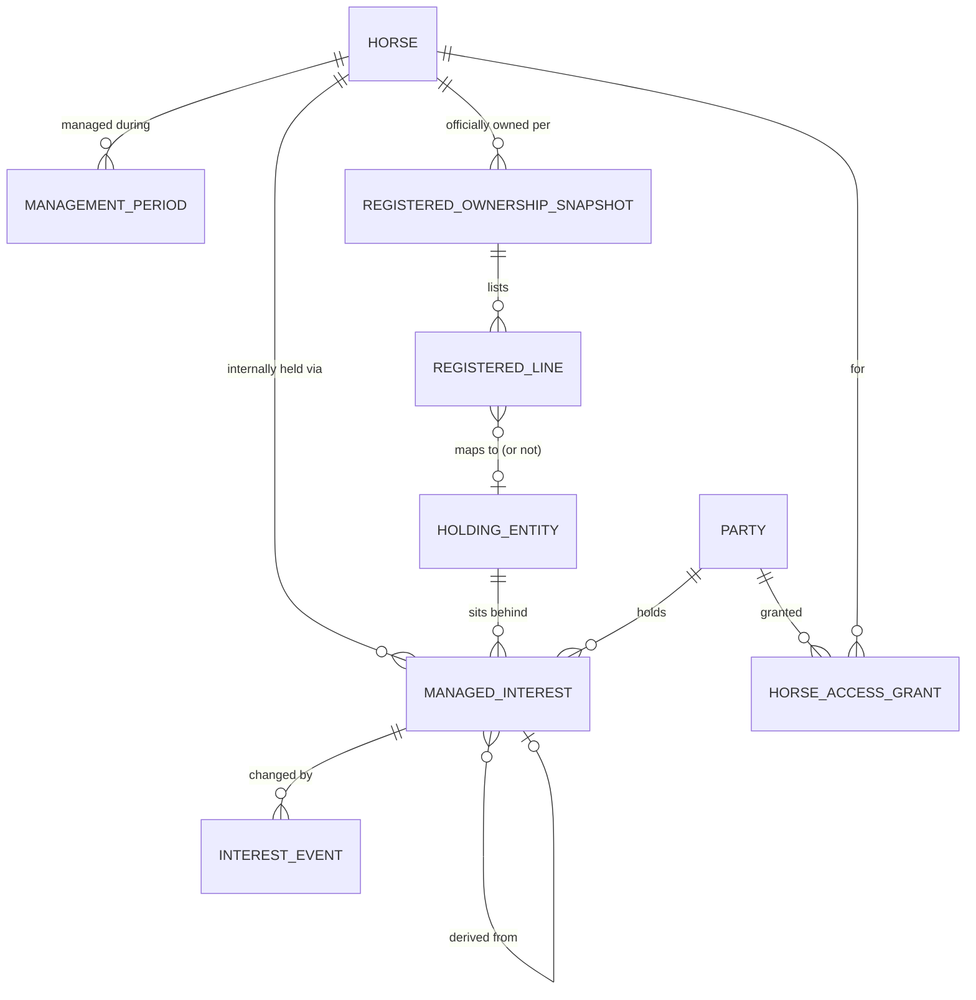

# Laurel Oak Bloodstock — Ownership Model

_Draft v0.1 — 2 Sep 2026. Full spec of ownership, transfers and access. Extends `data-model.md` and **supersedes its §5 visibility rule**._

---

## 1. The distinction everything else depends on

There are **two ownership ledgers**, and conflating them is the single biggest trap in this domain.

**Registered ownership** is what the industry says. It comes from the racing body, appears in the race book, and is a list of legal names with a managing owner. It may include people Laurel Oak has never met and must never contact — a co-owner who bought half the horse and manages their own clients, a partnership entity, a lessee.

**Managed ownership** is Laurel Oak's own book. It is who actually receives communications, who sees the horse in the portal, and who Laurel Oak has a relationship with. Its members may not appear in the registered record at all — six clients sitting behind a single "Laurel Oak Bloodstock" line in the race book.

```
REGISTERED (from racing body)          MANAGED (Laurel Oak's book)
─────────────────────────────          ──────────────────────────
Laurel Oak Bloodstock (Mgr: …)  ──►    Laurel Oak house share   10%
                                       Client A                 15%
                                       Client B                 15%
                                       Client C                 10%
D. Fitzgerald                   ──►    Client D                 10%   (also a client)
Rosehill Racing P/S             ──►    (no expansion — external, display only)
M. J. Corrigan                  ──►    (no expansion — external, display only)
```

**The rules that fall out of this:**

- Registered ownership is **read-mostly, imported, versioned**. Never hand-edited to match the internal book.
- Managed ownership is **the only thing that drives communications, portal access and notifications**.
- A registered line may map to a managed entity, to a single party, or to nothing at all. *Nothing at all* is a legitimate, permanent state — not an error to be cleaned up.
- The two will disagree on timing. An internal deal is done weeks before the transfer is registered. Both dates are recorded; neither is "wrong".

---

## 2. Entities



### MANAGEMENT_PERIOD
Whether the horse is Laurel Oak's at all. From, to, status, reason ended.

A horse can leave and come back — sold as a racehorse, repurchased years later as a broodmare, or her progeny arriving as a new horse record. Ownership is *inside* a management period; the horse record spans all of them.

### REGISTERED_OWNERSHIP_SNAPSHOT and REGISTERED_LINE
A versioned snapshot each time the official record is imported. Each line: ordinal, registered name string, percentage if published, role (Owner / Lessee / Lessor / Managing Owner), and an optional mapping to a holding entity or party.

Snapshots rather than a mutable list, because "who was officially in it on race day" must stay answerable after the record changes.

### HOLDING_ENTITY
The thing that appears as one line in the registered record. Types:

| Type | Expands internally? |
|---|---|
| Laurel Oak managed syndicate | Yes — into managed interests |
| Laurel Oak house share | Yes — Laurel Oak as a party |
| Direct client (registered in own name) | Yes — one party |
| External / unmanaged | **No** — display only, never contacted |

The last row is the answer to bullet four: external co-owners exist in the model as names on a registered line and go no further. They have no party record, no contact details, no access, and cannot be accidentally added to a distribution list.

### MANAGED_INTEREST
The core record. Replaces `OWNERSHIP_INTEREST` from the data model sketch.

| Field | Purpose |
|---|---|
| Horse, management period | What it is in |
| Party | Who holds it |
| Holding entity | Which registered line it sits behind |
| Kind | Ownership / Lease / Racing right / Breeding right |
| Share | Percentage or units — units are safer for splitting |
| Effective from, effective to | The commercial dates |
| Registered from, registered to | The official dates (may be null, may lag) |
| State | Pending / Active / Exited / Forfeited / Transferred |
| Derived from | The interest this one came out of — a provenance chain |
| Access policy | Standard / Retained read-only / Locked out |

**Provenance is worth the column.** A 2.5% share that has passed through three hands can be traced, which matters when someone asks why a name appears in a five-year-old email.

### INTEREST_EVENT
Every change, as a record: created, part-sold, transferred, exited, forfeited, suspended. Holds effective date, counterparty interests, price if relevant, and who actioned it. This is both audit and the trigger source for communications.

### HORSE_ACCESS_GRANT
Explicit access that is not implied by a live interest: a former owner given read-only access to their period, an accountant acting for a client, a partner's representative. Party, horse, scope, from, to, granted by.

Keeps exceptions out of the ownership table, where they would corrupt the share arithmetic.

---

## 3. The access rule

**Superseding `data-model.md` §5.** Your two scenarios point the opposite way to what I had assumed, and they are consistent with each other:

> **Access follows the current interest, not the dates it was held.**

A party may see a horse's stream when **all** hold:

1. They hold an **Active** managed interest in the horse in its **current management period** — or have an explicit access grant; **and**
2. The item's audience includes owners; **and**
3. The item is not scoped to specific parties they are not among.

Consequences, stated plainly:

- **An exiting owner is locked out immediately.** No further notifications, no portal access, nothing. Their history remains visible to staff — lockout is an owner-facing state, not a deletion.
- **An incoming owner sees the horse's complete history** back to purchase, including events long before they bought in.
- **A prior management period is excluded by default.** New owners after a horse is sold away and later returns should not inherit the previous group's correspondence.

### What this forces elsewhere

Because dates no longer filter anything, **the entire burden of confidentiality moves onto item scoping.** This is the price of the rule and it needs to be designed for, not discovered.

Every stream item needs one of:

| Scope | Visible to |
|---|---|
| Internal | Laurel Oak staff only |
| Owners | Anyone with a live interest, now and in future |
| Owners at the time | Only parties who held an interest on the item's date — **never** later owners |
| Named parties | An explicit list |
| Trainer | Trainer plus staff |

"Owners at the time" is the important addition. Anything about the commercial affairs of a particular owner — an exit negotiation, a share being offered around, a payment problem, a dispute — must carry it, or a new owner buying in next month reads the previous owner's business. Applying it should be the **default for anything generated by an INTEREST_EVENT**, so staff opt out rather than remembering to opt in.

---

## 4. Scenarios

### The four you described

**1. Owner exits, remaining three absorb the share.**
Exiting interest → state Exited, effective to = today, access policy Locked out. Three new interests created for the remaining owners, each with `derived from` pointing at the exited one, share increased proportionally. Access revoked at the next request; notification lists are computed at send time so nothing queued reaches them. One permitted exception: a final wrap-up communication (settlement, thank-you), sent from the interest event rather than the stream.

**2. Share sold to a new owner, possibly split among several.**
Same exit record. One or more new interests created, `derived from` the exited one. Each new party sees the complete history — except items scoped "owners at the time", which by design includes the negotiation that led to them buying in.

**3a. Complete change of ownership, in-house.**
All existing interests exited, a new set created inside the **same** management period. The horse never left Laurel Oak, so the incoming group inherits full history under the rule above. This is scenario 2 at 100%.

**3b. Sold entirely to a third party.**
Management period closes. All interests exit. Portal access ends for everyone. The horse record persists — pedigree, history, and the strong chance she returns as a broodmare or her progeny come through a sale. If she returns, a new management period opens and, by default, does not expose the old one.

**4. Laurel Oak plus six clients, with other names in the official record.**
One holding entity of type *managed syndicate* covering the Laurel Oak line, expanding into seven managed interests. Other registered lines map to external holding entities with no expansion. Race books and official communications display the registered list; the portal and every distribution list use the managed list. They never mix.

### The ones you haven't listed

These are the mess you said you couldn't fully enumerate. Each is either handled by the model above or flagged as needing a decision.

| Case | Handling |
|---|---|
| **Share split** — 5% sold as two 2.5% | Units rather than percentages; two new interests, same `derived from` |
| **Same owner, new legal entity** — moves into a family trust or company | New party (legal), linked to the same person; access continuity by person, registered name changes |
| **Death of an owner, estate transfer** | Interest transfers to the estate party; needs a sensitive-handling policy for communications |
| **Relationship breakdown / split of a jointly held share** | Split, as above, but often contested — an interest state of *Suspended* is useful |
| **Owner defaults on payments** | State Forfeited; share reverts to Laurel Oak house or is offered on. Access ends |
| **Leased racehorse** | Interest kind = Lease. Lessee races and receives communications; lessor may still need visibility of welfare and results but not raceday social arrangements |
| **Breeding rights held separately from racing** | Interest kind distinguishes them; matters once the mare retires |
| **Pending / unsettled transfer** | State Pending — agreed but unpaid or unregistered. No access until Active |
| **Package deals** — a share across three yearlings | The interest is per horse; a *deal* record groups them so the client sees one commercial arrangement and three horses |
| **Foal ownership inheriting from the mare** | Default rule: a foal's interests are seeded from the dam's at foaling, then diverge. Explicitly a default, always overridable |
| **Managing owner role** | A role on a party, not an ownership share — determines who receives official industry communications |
| **Laurel Oak house share** | Laurel Oak as an ordinary party holding an interest. Keeps the arithmetic honest |

---

## 5. Decisions I need from you

1. **The lockout is absolute?** An exiting owner loses all access to the horse, including the years they paid for. Some businesses give read-only history instead. `HORSE_ACCESS_GRANT` supports either — I have defaulted to your words: locked out.
2. **Does a returning horse's new group see the old management period?** Defaulted to no.
3. **Lessors** — where do they sit on the visibility scale?
4. **Foal-from-dam ownership seeding** — is that a real default in practice, or does every foal start from scratch?
5. **Units or percentages?** Units survive splitting far better. Percentages match how everyone talks. Suggest units stored, percentages displayed.
6. **Who can action an interest change?** Staff-initiated only, presumably — but does it need two people, given it changes who can see what?

---

## 6. Still open

- How registered ownership is actually obtained — Arion feed, racing body export, or manual entry per change.
- Whether an unmapped registered line should raise a prompt for staff to map it, or stay silent.
- Whether share history needs to reconstruct a full cap-table view at any past date. It can, with what is above — the question is whether anyone will ask.
